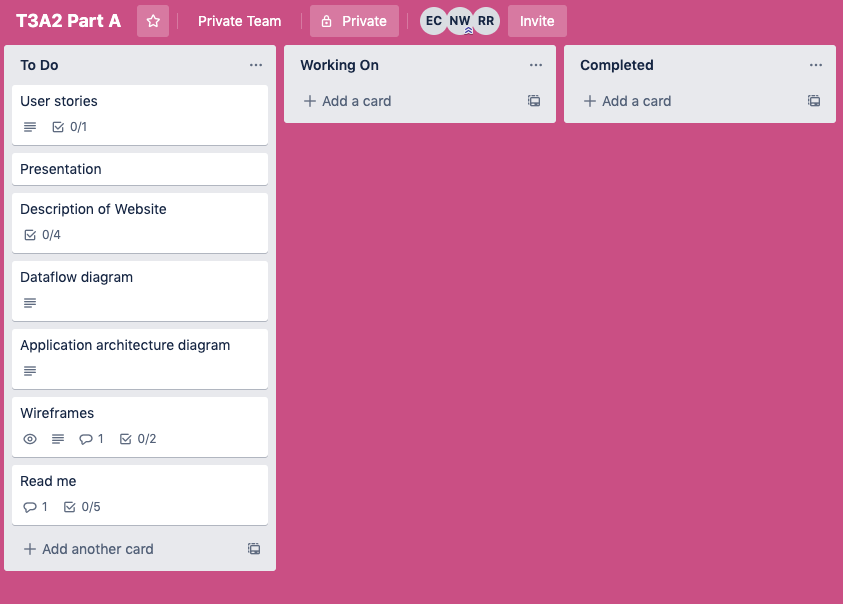
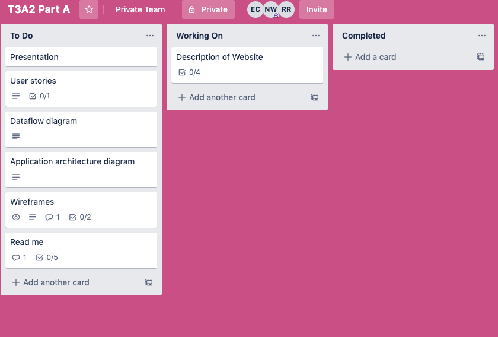

# 
 Part A

 
 
 A project by Esther Csoke, Nikki Waelkens and Rose Hernandez.

 
 
  

## R1. Description of website

### Purpose

The purpose of the website is to provide a place for women, and who identify as women whom are beginner programmers to:

- Connect with other women who are starting off in the tech industry.
- Post and find git collaborations. 
- Find local meet ups.
- Provide support and tools through forums.
- Allow women to practice blog writing by posting tech blogs.
 
### Functionality/ Features

- Forums
- Blog
- User authentication
- User profile
- Project Collaborations

### Target Audience
This website is catered for women whom are located in Australia. More specifically, women interested in technology and coding. Offering features for those whom are beginning their technlolgy careers, have established a career and/or looking to connect with likeminded women within the industry.

### Tech Stack

- [React](https://reactjs.org/).
- [JavaScript](https://www.javascript.com/).
- [Ruby on Rails](https://rubyonrails.org/).
- [Ruby](https://www.ruby-lang.org/en/).
- [Amazon S3](https://aws.amazon.com/).
- [Heroku](https://heroku.com/).
- [CSS](https://www.w3.org/Style/CSS/Overview.en.html).
- [Git](https://github.com/).
- [PostgreSQL](https://www.postgresql.org/).

--- 

## R2. Dataflow Diagram

## R3. Application Architecture Diagram

# 
 R4. User Stories

#### User: Natalie

Residing in Brisbane, Natalie has been working in the technlogy industry for five years. Natalie studied computer science at university and is currently working as a mid level software developer. She is wanting to connect with and provide mentorship for women in the industry.

As a web developer I want to:
- Be able to connect with other female web developers in Brisbane and Australia
- Be able to share my experience as a female web developer. 
- Be able share and receive career, personal and technology realted advice.

####  User: Amber

Amber, a 35 year old mother of two who is wanting to get into tech for a career change. She is currently working as a nurse full time. She is a self taught beginner coder. Amber has weekends and afternoons to practice, as her husband is fully supportive of her career change. 

<i>I am wanting to establish myself in the tech industry by meeting other women who are passionate about programming </i>

As a beginner coder I want to:
-  be able to socially connect with other beginner coders while feeling assured my data and personal information is protected. So that I can make personal connections with women in Australia.
- I want to find collaborations with other beginner programmers so I can practice using source control and working as a team.
- I want to have the ability to post my own git colloration listing so that I may find other women to complete mini projects with.
-  I want to have the ability post blogs and have other users comment and give critque of my blog so that I can practice my blog writing skills.

####  User: Melissa

Melissa is a highschool student that likes video games and has an interest in tech but she sees that tech and video games are dominated by men. She would like to find a community where she feels safe and not afraid of asking questions.

As a beginner coder I want to:
- Be able to find a supportive community of women in tech.
- Be able to ask questions.
- Be able to meet women that share the same interests.
- Be able to gain knowledge and tools needed to enter the world of coding.

## Planning

#### Day 1 
###### 13/07/2020

The team first created a Trello Board to provide a clear outline of what needed to be done and when by. We allowed some extra time between tasks to allow for any issues that could possibly rise. 

  

We decided to begin with first writing the decription of the website. 

  

#### Day 2

We began the day 

#### Day 3

#### Day 4

#### Day 5
